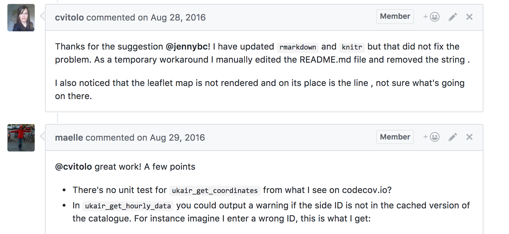

## Outline

-   Introduction
    -   About you and us
    -   Why this process, and why this talk?
-   Two crucial components
    -   The way we communicate.
    -   The way we build and review software.
-   Wrap up
    -   Takeaways.
    -   Questions and comments.

# Introduction

## About you and us

About you:

-   You're curious about rOpenSci's review process.
-   You may want to author, review, or edit an R package for rOpenSci.

## About you and us

About us:

*Mauro:*

-   I build tools to support research in green finance.
-   Before I was a biologist.
-   I joined rOpenSci in 2018 and played different roles.

*Noam:*

-   I am a disease ecologist that works with modeling and field teams
-   I've worked with rOpenSci since 2014, primarily doing peer-review editorial work
-   I've been Executive Director for \< 3 weeks!

## [Why peer-review?](https://github.com/ropensci/software-review?tab=readme-ov-file#why-and-how-submit-your-package-to-ropensci)

-   Drive adoption of best practices and standards
-   Increase quality in the long tail of applications
-   Build a community of practice

## Drive adoption of best practices and standards

_Some quotes from authors and reviewers:_

> "The review process taught me a lot about different tools available for making my code more robust and resilient to future changes."

> "I learn a lot from closely reading other people's code and it is hard to do when I'm not forced to review so closely."

> "I really love the rOpenSci pacakage review process, especially its interactivity and how much you can learn from others."

## Increase quality in the long tail of applications

The long tail: monthly downloads of all CRAN packages

{width=100%}

## Increase quality in the long tail of applications

{width=100%}

## Build a community of practice

{width=100%}

## This was something of an accident!

rOpenSci evolved from 

 - A group of people who wrote R packages, to
 - A group of people who manageed a lot of R packages, and realized we needed review, to
 - A group of people who reviewed R packages, and realized we needed a process, to
 - A group of people managed a review process, and realized ***we needed a community.***

## Why this talk? \| The process is complex and can feel overwhelming

The process is complex and can feel overwhelming.

This talk:

-   Highlights the most important materials.
-   Shows you where you can find the rest.
-   Gives you the chance to ask questions.

# Two crucial components

* The way we communicate: [Code of conduct](https://ropensci.org/code-of-conduct/).
* The way we build and review software: ["Devguide"](https://devguide.ropensci.org/).

> "[Helping to improve software] in a kind and respectful way is just as important as the technical aspect".  
> -- Yanina Bellini Saibene

## Be kind and respectful

[Example of a kind and respectful reviewer's response](https://github.com/ropensci/software-review/issues/577#issuecomment-1494333794).

> "It's like when I hold the door open for someone."  
> "Even when someone volunteers their time, there is a cost of their time and effort."  
> -- [Setting expectations for open source
participation](https://snarky.ca/setting-expectations-for-open-source-participation/amp/)

## Be kind and respectful \| [Example of a kind and respectful reviewer's response](https://github.com/ropensci/software-review/issues/577#issuecomment-1494333794)

> "It's like when I hold the door open for someone."
>
> "Even when someone volunteers their time, there is a cost of their time and effort."
>
> -- [Setting expectations for open source participation](https://snarky.ca/setting-expectations-for-open-source-participation/amp/)

## The way we build and review software

Guide for authors

-   [Package categories in scope for rOpenSci review](https://devguide.ropensci.org/softwarereview_policies.html#package-categories).
-   [Guide to building a package](https://devguide.ropensci.org/building.html).
-   [Guide to submitting a package](https://devguide.ropensci.org/authors-guide.html).
-   [Choose between different types of submission](https://github.com/ropensci/software-review/issues/new/choose).

Other guides, templates, and tools

-   [Guide for reviewers](https://devguide.ropensci.org/reviewerguide.html) and [editors](https://devguide.ropensci.org/editorguide.html).
-   [Template for reviewers](https://devguide.ropensci.org/reviewtemplate.html) and [editors](https://devguide.ropensci.org/editortemplate.html).
-   [Bot commands](https://devguide.ropensci.org/bot_cheatsheet.html).

# Wrap up

## Takeaways

-   Be kind and respectful.
-   The process is complex but you'll find lots of help.

## Questions and comments?

Thank you!

Mauro \| [maurolepore\@gmail.com](mailto:maurolepore@gmail.com){.email}
